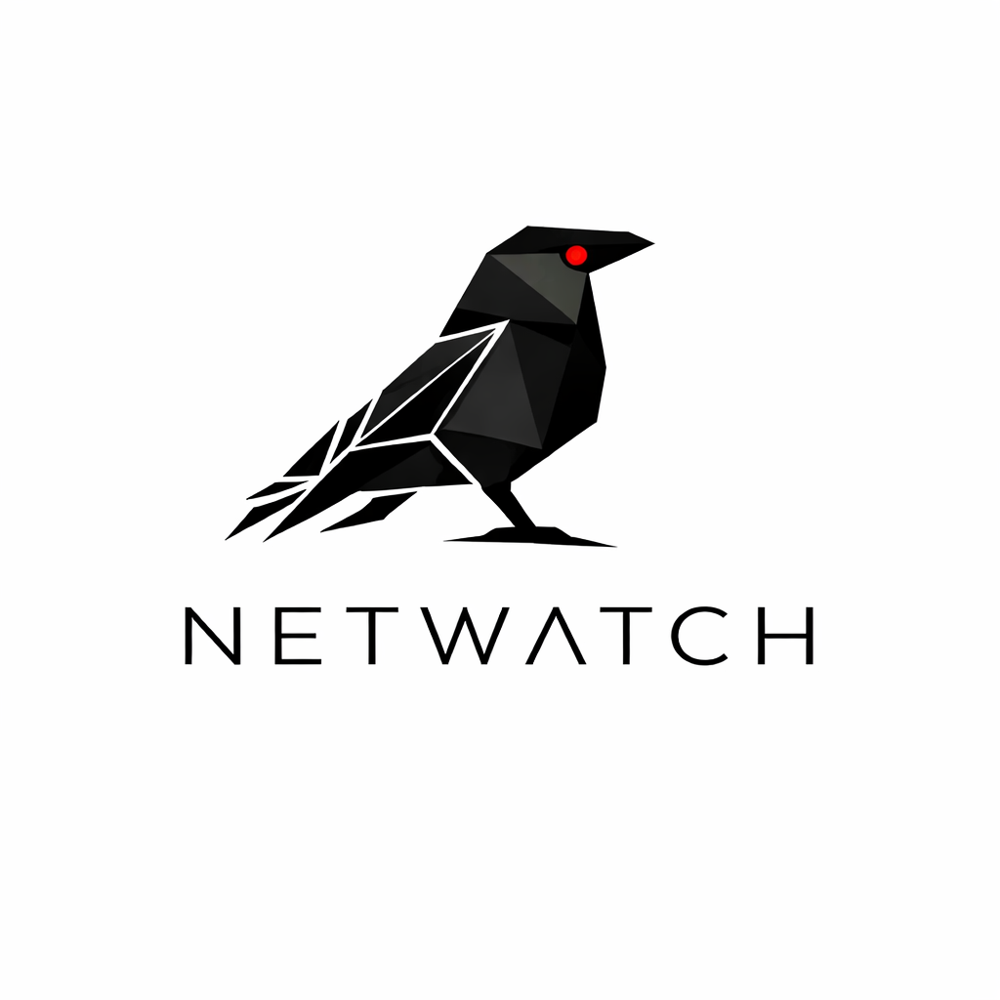

  

<h1 align="center">NetWatch Threat Advisories</h1>

<em>Your scanner has a fingerprint too.</em>

Public threat advisories for previously undocumented tools targeting AI/ML infrastructure.

## Overview

These advisories document scanning tools and attack tooling observed in the wild that target exposed AI/ML infrastructure — LLM inference servers, MCP endpoints, AI IDE configurations, and related services. Each advisory includes indicators of compromise, behavioral analysis, and detection guidance.

Tools documented here have no prior public reporting. If a tool already has CVEs, blog posts, or vendor documentation, it doesn't need a NetWatch advisory.

## Advisories

| ID | Tool | Target | Published |
|---|---|---|---|
| [NWTA-2026-002](advisories/NWTA-2026-002.md) | gitmc-org-mcp-scanner | MCP servers | 2026-03-11 |
| [NWTA-2026-001](advisories/NWTA-2026-001.md) | LLM-Scanner/2.0-Fast | LLM inference endpoints | 2026-03-11 |

## Detection Signatures

Machine-readable detection signatures (IP blocklists, header fingerprints, behavioral rules) are published in the companion repository: **[netwatch-signatures](https://github.com/NetWatchReport/netwatch-signatures)**

These signatures are consumed by [Blackwall](https://github.com/NetWatchReport/blackwall), a reverse proxy purpose-built for protecting self-hosted LLM infrastructure.

## Reporting

Seen one of these tools? Found a new one? Report sightings and new threats: abuse@netwatch.report

Sighting reports help us track infrastructure rotation, geographic spread, and behavioral evolution across tool versions.

## License

MIT
